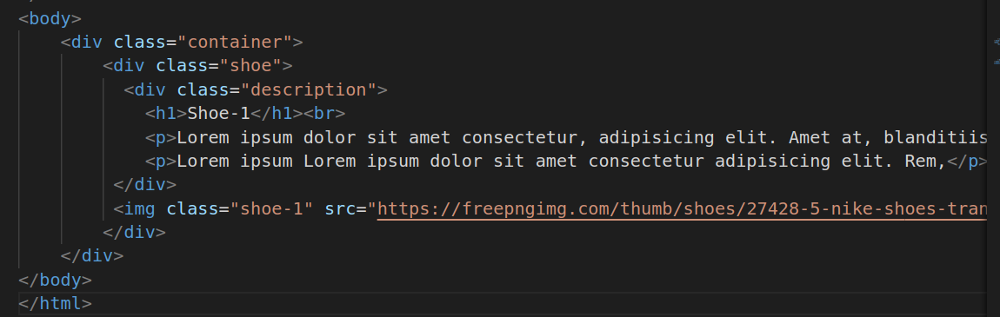
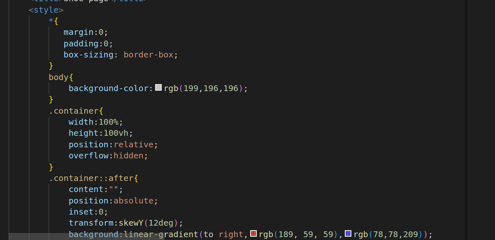
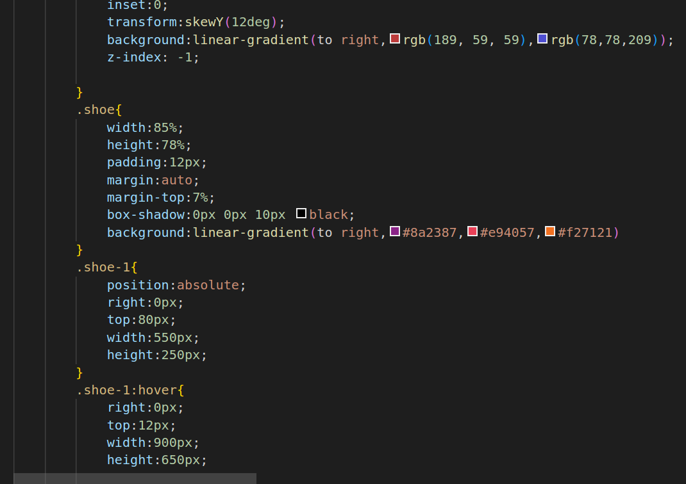
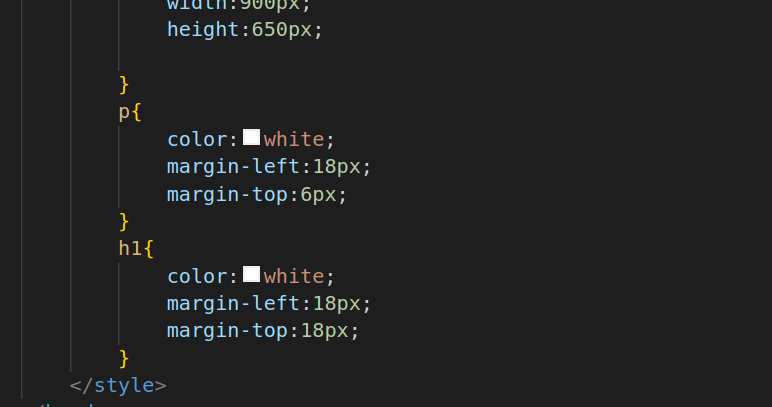

# Shoe Page
1.
* THe div class="container":
Purpose: Creates a container for the shoe and its description.
Explanation: It encapsulates the content related to the shoe, allowing for styling and positioning.
* The div class="shoe":
Purpose: Creates a container for the shoe image and description.
Explanation: It holds the shoe image and description text, making it a single entity for styling.
* The div class="description":Purpose: Creates a container for the shoe's description.
Explanation: It holds the text content related to the shoe, allowing for separate styling from the image.
* The h1 and p:
Purpose: Define headings and paragraphs within the shoe description.
Explanation: They structure and display text content related to the shoe, providing context and information about the product.
* The img class="shoe-1":
Purpose: Embeds an image element with the class "shoe-1."
Explanation: It displays the shoe image and has hover effects applied to it to change its position and dimensions when hovered over.

2.

3.

4.
* Universal Selector (*):
margin, padding, box-sizing:
* margin sets the margin space around elements.
* padding sets the padding space inside elements.
* box-sizing controls how the width and height of elements are calculated, with border-box including padding and borders in the total dimensions.
* Purpose: These properties are used to reset the default margin, padding, and box-sizing for all elements to ensure consistent spacing and sizing throughout the document.
* body Selector:background-color:
Sets the background color of the body element.
* Purpose: This property defines the background color for the entire web page.
* .container Selector:width, height:
* width sets the width of the container to 100% of its parent element.
* height sets the height of the container to 100 viewport height (100vh), making it fill the entire viewport height.
* Purpose: These properties define the dimensions of the container, ensuring it covers the entire screen.
* position, overflow:position sets the positioning context of the container to relative.
* overflow hides the overflow content that extends beyond the container.
* Purpose: These properties create a positioning context for the container and hide any content that goes beyond its boundaries.
* ::after Pseudo-Element:content inserts content into the container after its content.
* position sets the pseudo-element to absolute.
* inset positions the pseudo-element to cover the entire container.
* transform skews the pseudo-element by 12 degrees along the Y-axis.
* background sets a linear gradient background for the pseudo-element.
* z-index places the pseudo-element behind the content.
* Purpose: This pseudo-element creates a skewed background gradient behind the container for a visual effect.
* .shoe Selector:width, height, padding, margin, box-shadow, background:
* width sets the width to 85%.
* height sets the height to 78%.
* padding adds spacing within the shoe element.
* margin centers the shoe element both horizontally and vertically.
* box-shadow adds a shadow around the shoe element.
* background sets a linear gradient background.
* Purpose: These properties style the shoe element, giving it dimensions, spacing, shadows, and a background gradient.
* .shoe-1 Selector:position, right, top, width, height (Hovered):
position sets the positioning context of the shoe image to absolute.
right and top initially position the shoe image at the top-right corner.
* width and height change the dimensions of the shoe image on hover.
* Purpose: These properties create an interactive effect when hovering over the shoe image.
* p and h1 Selectors:
color, margin-left, margin-top:
color sets the text color to white.
margin-left and margin-top provide spacing for paragraphs and headings.
Purpose: These properties style the text within paragraphs and headings in the shoe description.

# Hosted Link
https://nikhitha5511.github.io/shoe/?authuser=0
